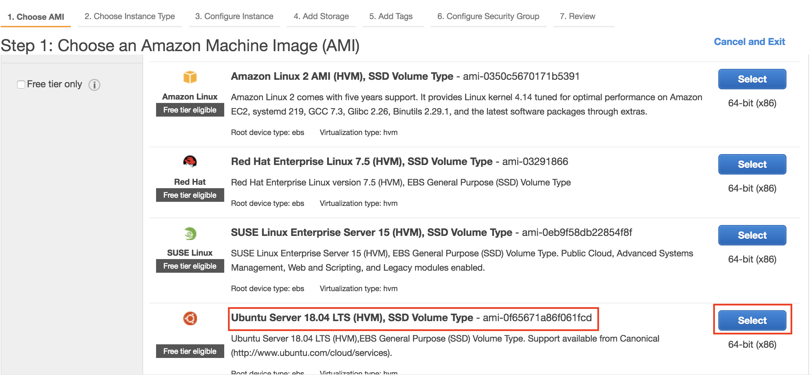
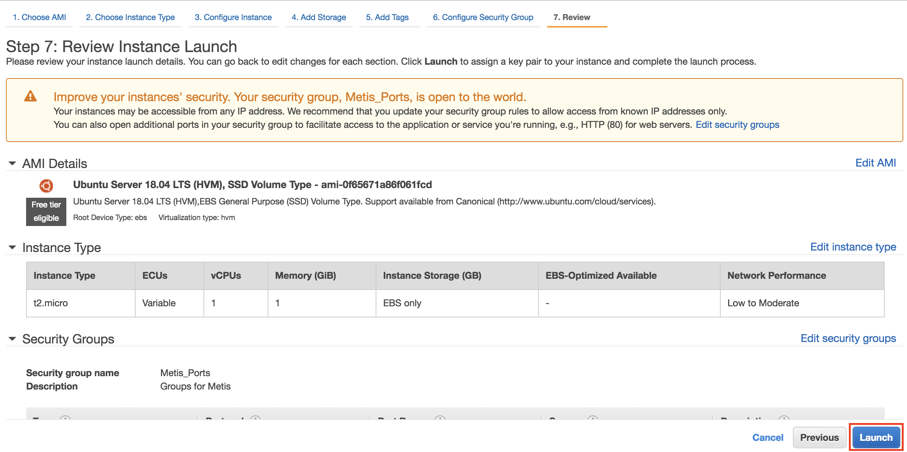

# Amazon Web Services
## Setting up Cloud Computing :cloud: :cloud: :cloud:

1.  Logging in  
  * http://aws.amazon.com/  
  * Note:  put your user id and password somewhere for easy reference
  * Note:  bookmark it!

2.  [AWS Free Tier](https://aws.amazon.com/free/)  
  * credit card required for log-in
  * designed to enable you to get hands-on experience with AWS Cloud Services
  * includes services with a free tier available for 12 months following your AWS sign-up date, as well as additional service offers that do not automatically expire at the end of your 12 month AWS Free Tier term.

3.  AWS Console  
  * Lot of options!  We will choose "Compute/EC2"  [upper left of screen]  
  * EC2 = Elastic Compute Cloud (Virtual Servers in the Cloud!)  

4.  Region [on upper right of screen]  
  * Select a region around your physical location
  * E.g. NYC would pick US East (N. Virginia)

5.  Create Instance  
  * From your EC2 Dashboard, click the blue **Launch Instance** button.

---

## Setting up Instance

1. Choose an Amazon Machine Image (AMI), (4th in list):  **Ubuntu Server** [press blue Select button]

  
2. Choose an Instance Type:  Select a **Free tier eligible** "t2.micro" instance

  

3. **Next: Configure Instance Details**  [accept default]  

4. **Next:  Add Storage**  [set to free max of 30GB]

  

5. Tag Instance. You can skip this part, and click "Next: Configure Security Group"

6. **Next:  Configure Security Group**  

  You should click "Add Rule" to add the following rules:

|Type| Protocol | Port Range | Source | Description (optional) |
|---|---|---|---|---|
| HTTP | TCP | 80 | Anywhere | Allow REST and HTTP |
| PostgreSQL | TCP | 5432 | Anywhere | Allow remote access to postgres |
| SSH | TCP | 22 | Anywhere | Allow remote SSH access |
| Custom TCP | TCP | 27017 | Anywhere | MongoDB |
| Custom TCP  | TCP | 8888 | Anywhere | Jupyter Notebooks |
| HTTPS | TCP | 443 | Anywhere | Allow https connections |

  We won't use all these ports immediately, but it is easy to setup the ports we will need. Give the security group a memorable name such as "Metis_Ports"

  Your network panel should look like this:

  

7. Review Instance Launch: your set-up will look like below screenshot  


  Click **Launch**  

---

## Set up Secure Access  

1.  Choose to "Create a new key pair" and give it a name:  **aws_key**  
2.  Download keypair

---

### Keypair

1. Save file to your Downloads folder (`~/Downloads` on OSX).

2. Move your file to `~/.ssh/`.  (Note:  if you do not have an ssh folder, create one:  `mkdir ~/.ssh`)  
```bash
mkdir ~/.ssh
mv ~/Downloads/aws_key.pem ~/.ssh/aws_key.pem
```
  Make your file read only with `chmod 400 filename`
```bash
cd ~/.ssh
```

3. Check to see the file exists in the directory with `ls -la *aws_key*`
```bash
$ ls -al *aws_key*
  -rw-r--r--@ 1   1692 Apr 23 14:46 aws_key.pem
$ chmod 400 aws_key.pem
$ ls -la *aws_key*
  -r--------@ 1   1692 Apr 23 14:46 aws_key.pem
```  
Notice how the permissions have been updated!

### `ssh` keys
Check that you have `id_rsa` and `id_rsa.pub` files within your `.ssh` folder  
```bash
ls ~/.ssh/*id_rsa*
```
>Example:  
```bash
$ pwd
  /Users/damien/.ssh
$ ls -la *id_rsa*
  -rw-------  1   1675 Jun  2  2018 id_rsa
  -rw-r--r--  1    422 Jun  2  2018 id_rsa.pub
```  

#### Generate `ssh` keys
If you do not have them, generate them with
```
ssh-keygen -t rsa
```
When asked where to save, the default location is correct (ex: /Users/username/.ssh/id_rsa),  so hit Enter.


---

## Connecting to your Instance  
### AWS:  
**Launch Instance**

### Set Up Billing  
Find (in blue):  "Get notified of estimated charges"  
Select **Create billing alerts**  
Check all 3 preferences and select **Save preferences**  
You can then close this tab.

### Get the public IP

On your EC2 Dashboard, you'll soon be able to find the **public** IP address of your new cloud computer!


Do **not** use the private IP address.
**Note:  It may take a few minutes for the instance to initialize.**

### On Your Local Machine: using IP address

1. Open a new terminal window.

  **YOU MUST OPEN A NEW WINDOW**
2. Type the following command (the starting directory doesn't matter)
```bash
$ ssh -i ~/.ssh/aws_key.pem ubuntu@<my_public_ip>
```
  For example, to log onto the instance on the screenshot above, I would use `ssh -i ~/.ssh/aws_key.pem ubuntu@18.216.164.22`

  The first time you connect to a new IP address, you will be asked if you are sure you want to connect. Enter `Y` to log in.

  If you are successful, you should get the prompt
  ```bash
  ubuntu@ip-172-31-38-29:~$
  ```
  telling you that you are logged in as user `ubuntu` onto your AWS instance.

**Note:** You need your _public ip_ to log in (in this case `18.216.164.22`) but the prompt in the terminal will include the _private ip_ address (in this case `172.31.38.29`).

### On your local machine: using the config file (OPTIONAL)

You can link the identity key (`aws_key.pem`) and public IP address to a simple to remember name. We will use `myaws`.

1. Open your `config` file
```sh
vim ~/.ssh/config
```

2. Modify the file to be
```sh
Host myaws
        HostName 18.216.164.22 # use your IP instead
        User ubuntu
        IdentityFile ~/.ssh/aws_key.pem
```

  You should use _your_ public IP instead of `18.216.164.22`. Then save and exit the file (<kbd>ESC</kbd>` :wq`).


You can check if this worked by trying
```sh
ssh ubuntu@myaws
```
in the terminal. If successful, you should be connected to your AWS instance.

#### To exit Ubuntu machine (AWS cloud machine)  

```bash
exit
```  

>Example:  
```bash
ubuntu@ip-172-31-38-29:~$ exit
logout
Connection to 18.216.164.22 closed.
```
