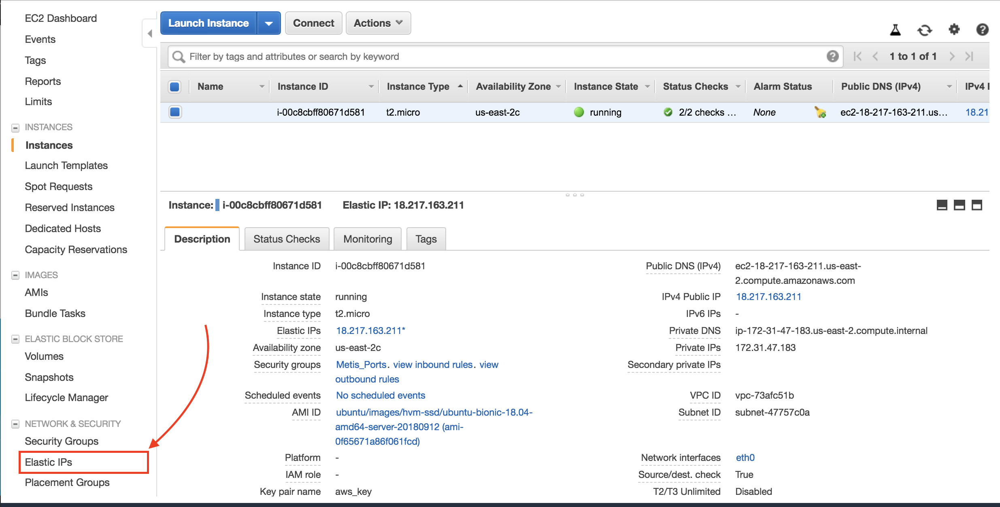

# Keeping your IP

The steps in this document are completely optional. Following this guide will allow you to keep the same public IP, even when you stop and restart your instance. This can simplify connecting.

We will need to
1. _Allocate an IP_ (on AWS Console)
2. _Modify the ssh config file_ (on your local machine)

## Allocating an IP to your instance

By default, AWS will assign a public IP address to your instance. Your machine will keep the same public IP until it is reset / restarted. Once reset, we need to edit the `config` file, or lookup the new IP address (instead of using the version stored in the terminal history.)

We can also reserve a public IP address, and attach that to our instance.

1. Go to EC2 page that lists your instances.
2. On the menu on the left, click "Elastic IPs" (under Network and Security)

3. Click the blue "Allocate New Address"
4. The defaults on the next page are fine. Click "Allocate"

5. Click Close.
6. Select the IP address with the checkbox, then under the "Actions" dropdown, select   "Associate Addresses"

7. Select the instance and click "Associate"


At this point, my AWS instance has been associated with the IP address `18.217.104.97`. Your IP address will be different.

## Modifying your `hosts` file

1. Open your `config` file
```sh
vim ~/.ssh/config
```

2. Modify the file to be
   ```sh
Host myaws
        HostName 18.217.104.97 # use your IP instead
        User ubuntu
        IdentityFile ~/.ssh/aws_key.pem
```

  You should use _your_ public IP instead of `18.217.104.97`. Then save and exit the file (<kbd>ESC</kbd>` :wq`).


Check this by typing
```sh
ssh ubuntu@myaws
```
in the terminal. If successful, you should be connected to your AWS instance.

## For later: Reusing the IP

For some of your projects, it might be useful to create larger instances. You can attach associate the "reserved" IP with the new instance if you want, so you `myaws` always points to the instance you want to use.
