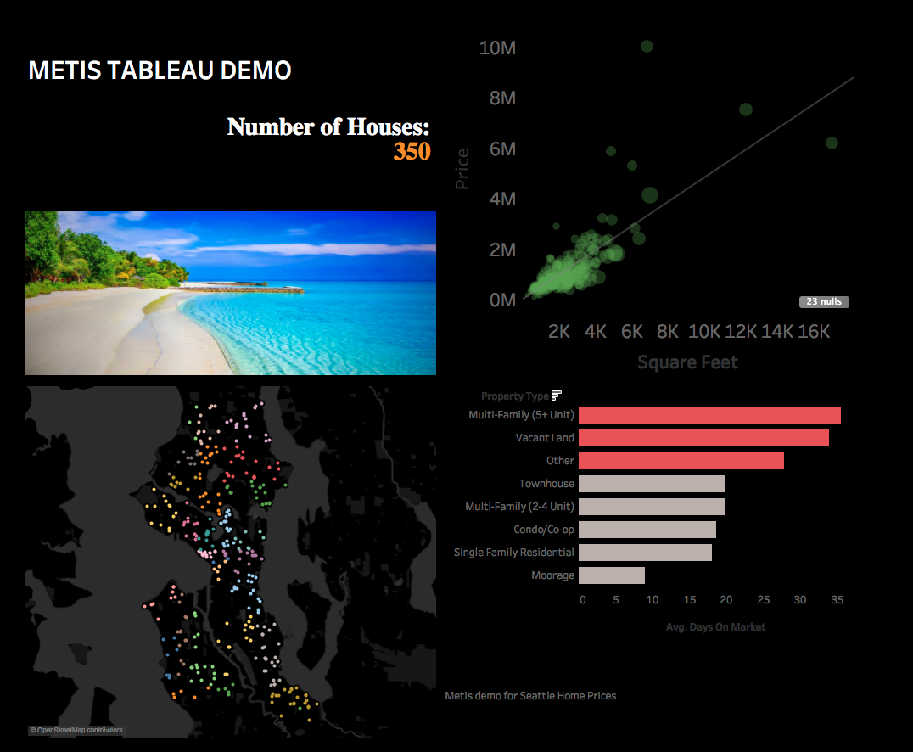

# Intro to Tableau - Seattle Home Prices Walkthrough

This walkthrough will introduce you to some of Tableau's core functionality, getting you up and running with a starting dashboard visualization. Start by downloading the free [Tableau Public](https://public.tableau.com/en-us/s/) app and setting up an account (available for Windows and Mac). If using Ubuntu use the free trial of [Tableau Online](https://www.tableau.com/products/cloud-bi).  Tableau Online does not have all the functionalities, but should be able to provide you with enough of an idea on how it works.

A few things about Tableau Public:
* Tableau is a tool that allows you to create interactive graphs and dashboards, that is commonly used in business settings.
* You can only save data to the web (not locally), so make sure you do not use proprietary data that cannot be publicly shared.
* Tableau allows you to embed your visuals in your blog posts. Here is an [example](https://www.robertoreif.com/blog/2018/1/7/become-a-us-president-with-only-22-of-the-popular-vote).

### Load the Data

Connect to the “SeattleHomePrices.csv” text file.  You'll see that Tableau will automatically guess the data type for each column.  You can fix them if they have been incorrectly labeled.  

### OPEN SHEET 1

Tableau populates "dimensions" (discrete or categorical variables) and "measures" (continuous variables) from the data set.

As you play around with worksheets and follow these steps, note that the "Show Me" tab displays a bunch of options of visualizations you could potentially construct, and tells you what dimensions/measures would be needed to create that visual.

#### Display the Number of Houses in the dataset

* Make the Mls# discrete by dragging the pill to a Dimension.

* Drag the Mls# directly onto the "Text" box in the "Marks" area. Aggregate the data by count (right click > Measure > Count). You should get 350.

* Play around with the formatting by clicking on the "Text" box - make the font bigger, change the color etc., change the title

### OPEN SHEET 2

#### Plot the Price Vs Square footage 

* Drag the "Square Feet" measure to columns, and the "Price" measure to rows. Note that Tableau will automatically aggregate the measures. Disaggregate them by pressing the "Analysis" drop down at the top and unselecting "Aggregate Measures".

* Change the dot marks to circles by clicking on the "Shape" box. Make the size of the dots proportional to the number of bedrooms by dragging the "Beds" measure to the "Size" box. Add transparency by adjusting the Color settings. 
    
* Add a linear trend line by right clicking on the chart > "Trend Lines" > "Show Trend Lines".

### OPEN SHEET 3

#### Create a map visualization of each house, colored by zip code

* Drag "Latitude" to Rows, and "Longitude" to Columns. Use the analysis tab to disaggregate measures again.

* Drag "ZIP" to the "Color" box (click add all members).

* Hover over each point, notice that a tooltip pops up with the coordinates and the zip code. We can edit what this tooltip displays. Drag the "Year Built" dimension to the "Tooltip" box, and see that this new info shows up when you hover over points.

### OPEN SHEET 4 

#### Create a bar chart that shows average days on the market broken out by property type

* Move "Property Type" to Rows and "Days On Market" to Columns.

* Aggregate "Days on Market" by Average (right click on pill > Measure > Average).

* Click on the "Property Type" pill and Sort descending by Average Days on the Market.

* Right click on the chart and select Format.  Play with the formatting of the chart.

* Create a Calculated Field called "BarColor" with the following expression, where it has a 1 if it has been more than 20 days on the market, and 0 elsewhere:
```
IF AVG([Days On Market]) > 20
THEN 1
ELSE 0
END
```
* Drag the BarColor measure to the Color, and customize it. You can also make the BarColor field discrete.


### OPEN A DASHBOARD

* Drag all 4 sheets we've created onto the dashboard, format the dashboard in a visually pleasing way.

* Add a filter by clicking Dashboard, Actions, Add Action > Filter. Select sheet 4 as the Source (Run action on: Select) and all sheets as targets. Set it so that clearing the selection will Show all Values.

### SAVE WORKBOOK

* Save your work to Tableau Public! You'll have to create a profile. Note that the dashboard will be visible to anyone on the internet.

* Once it's on Tableau Public, we can click the share button at the bottom and get an HTML embed code - you can add this to a blog to get an awesome interactive visualization!

             

### TRY CREATING A DASHBOARD WITH YOUR DATA!

*Note:* If you do decide to build a dashboard for your presentation, you are encouraged to present a pre-recorded a video of your demo.  This allows you to make sure your timing is correct and avoids any potential technical glitches.

