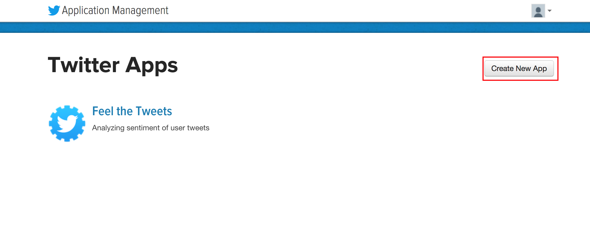
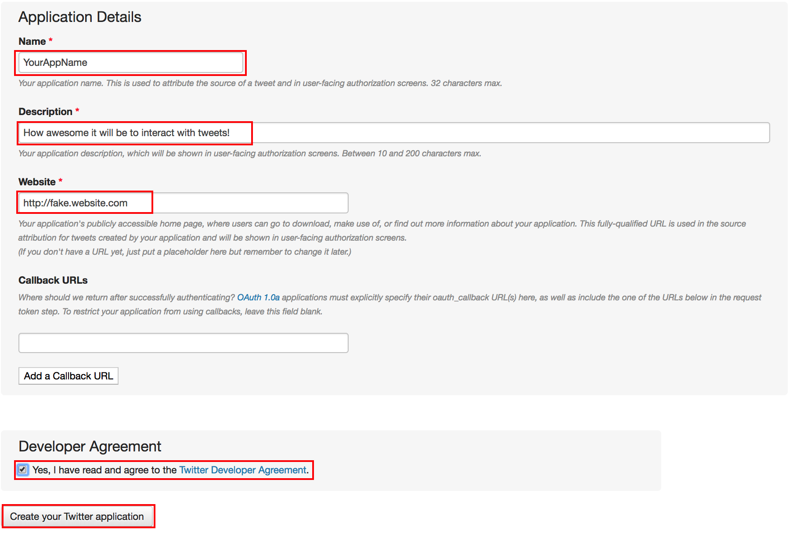

# Getting credentials for Twitter

We are going to register a Twitter application!

Start by going to [the Twitter homepage](http://app.twitter.com/). If you don't have a Twitter account yet, you can sign up for one here.

1. Copy `fake.env` to `.env`. This file is loaded, and in `.gitignore`, so your credentials don't get loaded to github.

2. Create a new application

3. Fill out the information about your application, specifically the **Name**, **Description**, **Website**. Then check the box and click the "Create your Twitter application" button. For the website, Twitter does allow you to put in a placeholder website if you want, or you can use `http://thisismetis.com/`.

4. Select the application you just created (in this case, I am using my old application)

5. Click on the tab "Keys and Access Tokens"

6. Now copy the 4 pieces of information from the screen to the `.env` file.

| Twitter field | To dictionary key |
|---|---|
| Consumer Key (API Key) | "TWITTER_CONSUMER_KEY" |
| Consumer Secret (API Secret) | "TWITTER_CONSUMER_KEY_SECRET" |
| Access Token | "TWITTER_ACCESS_TOKEN" |
| Access Token Secret | "TWITTER_ACCESS_TOKEN_SECRET" |
